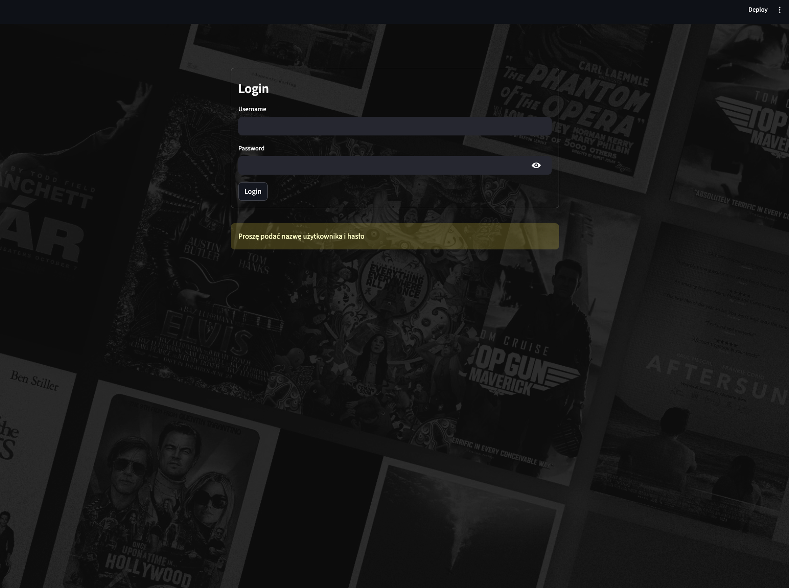
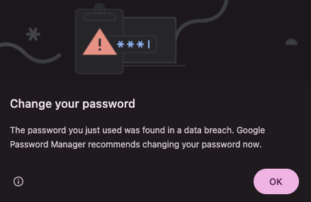
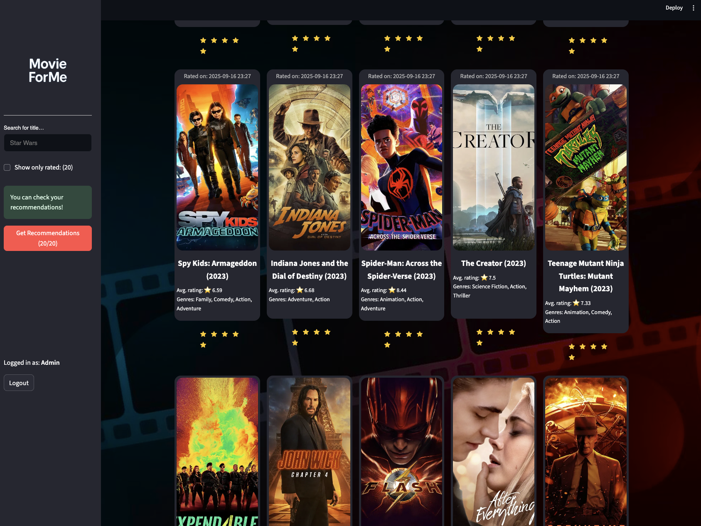
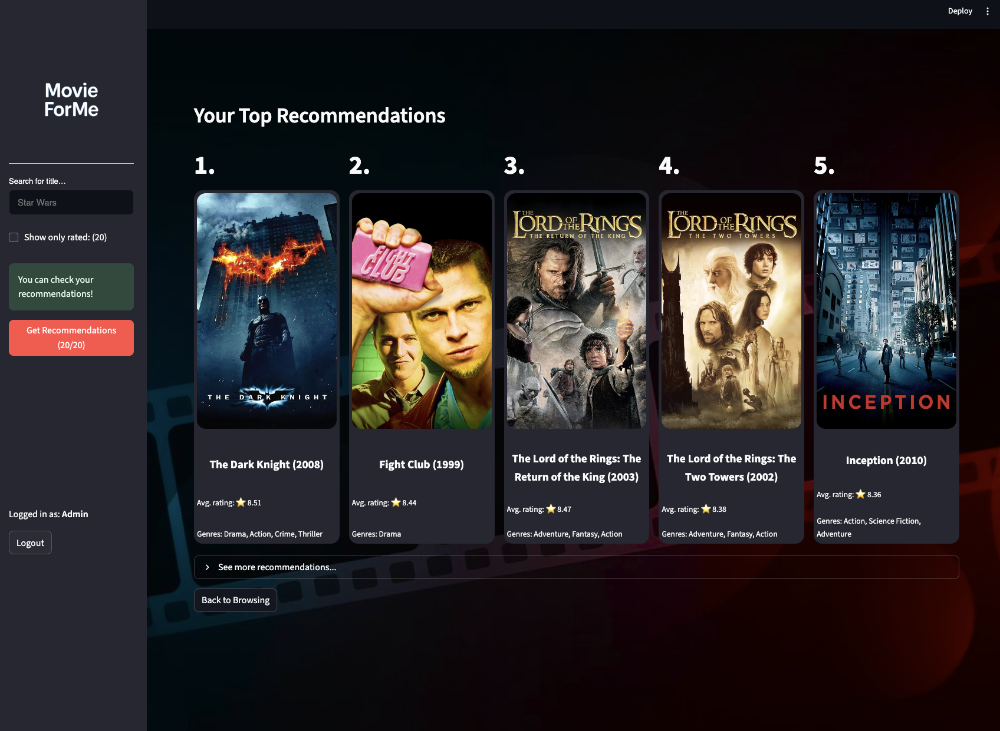

# Uruchamianie aplikacji

Należy zacząć od instalacji zależności:
```Bash
pip install -r requirements.txt
```

Następnie należy uruchomić bazę wektorową Milvus. Baza jest uruchamiana przy pomocy Docker Compose, więc wymagane jest wcześniejsze zainstalowanie środowiska Docker. Następnie w głównym katalogu projektu należy wywołać:
```Bash
docker compose up
```
Po uruchomieniu należy otworzyć nowe okno terminala, aby nie zamykać instancji Milvus. 

Następnym krokiem jest utworzenie kolekcji w bazie wektorowej oraz wygenerowanie wektorów osadzeń filmów. Służą do tego dwa skrypty. Najpierw należy przejść do katalogu `application/two_tower_model`, a potem uruchomić odpowiednie skrypty.
```Bash
python setup_vector_database.py
python setup_item_vectors.py
```
Po wywołaniu powyższych skryptów, możliwe jest uruchomienie aplikacji. Należy przejść do katalogu `application` i w nim uruchomić komendę:
```Bash
streamlit run app.py
```
Aplikacja uruchomi się na porcie 8501 na lokalnej maszynie. 

# Korzystanie z aplikacji
Jeżeli przeglądarka sama nie otworzyła się na adresie `localhost:8501`, to należy ją uruchomić i przejść na adres `localhost:8501`. 

## Logowanie
Na ekranie logowania należy wykorzystać nazwę użytkownika `admin` oraz hasło `admin`. 




## Ostrzeżenie o zmianie hasła
Wyskakujące okienko, które nalega do zmiany hasła, należy zignorować. Wystarczy kliknąć przycisk "OK". Wyświetli się ekran oceny filmów.




## Ocena filmów i generowanie rekomendacji

Na ekranie oceny należy przejrzeć listę filmów i ocenić dowolne filmy. Po wystawieniu 20 pozytywnych ocen system umożliwi wygenerowanie rekomendacji. Aby wygenerować rekomendacje, należy kliknąć czerwony przycisk "Get Recommendations".



Proces generowania rekomendacji zostanie uruchomiony. Po ich wygenerowaniu zostaną one wyświetlone na nowym ekranie.

## Wyświetlenie rekomendacji
Top 5 najbardziej trafnych rekomendacji zostanie wyświetlone w formie kart, z okładkami filmów. System generuje więcej niż 5 rekomendacji. Aby je wyświetlić, należy nacisnąć przycisk "See more recommendations...". Zostaną one wyświetlone w formie listy. 


